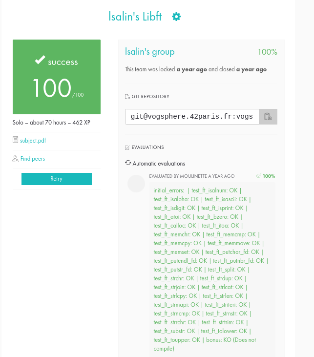

# libft

🇫🇷

Ce projet consiste à recoder certaines fonctions de la bibliothèque standard C, ainsi que d’autres fonctions supplémentaires qui ne font pas partie de la libc, ou qui en font partie mais sous une forme différente.

Compétences acquises :

.Compréhension des fonctions de la bibliothèque standard C et de la manière de les implémenter
.Fonctionnement d’un makefile
.Bonnes pratiques concernant la gestion de la mémoire

🇬🇧

This project consists of recoding some functions from the standard C library, as well as other additional functions that are not part of the libc, or which are part of it but in a different form.

Acquired skills :

Understanding of C standard library functions and how to implement them
How a makefile works
Memory management best practices

